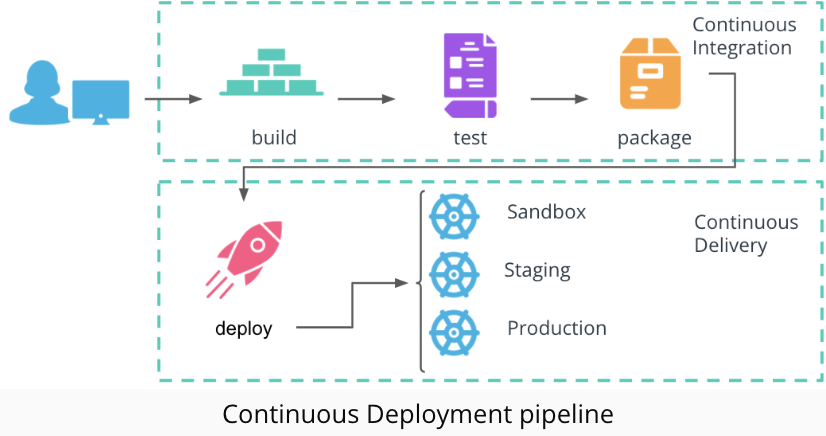

# Deploy python app to kubernetes with GitHub Actions and Argo CD



Retrieve the initial password for the admin user

```bash
kubectl get secret argocd-initial-admin-secret -n argocd -o jsonpath='{.data.password}' | base64 --decode; echo
```